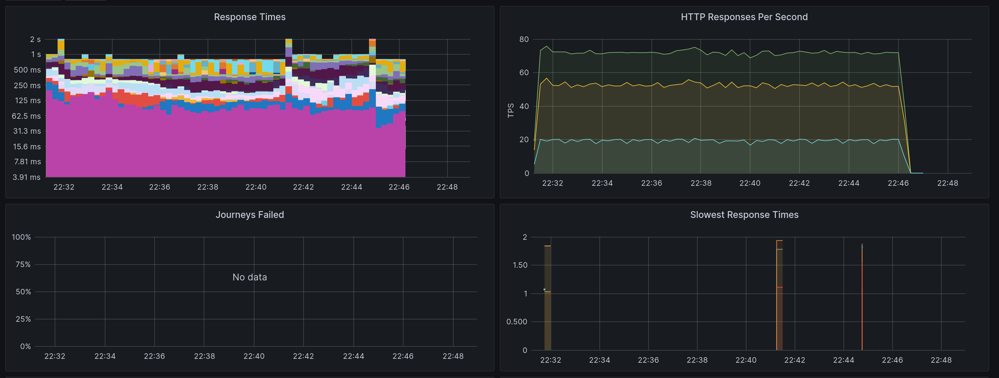
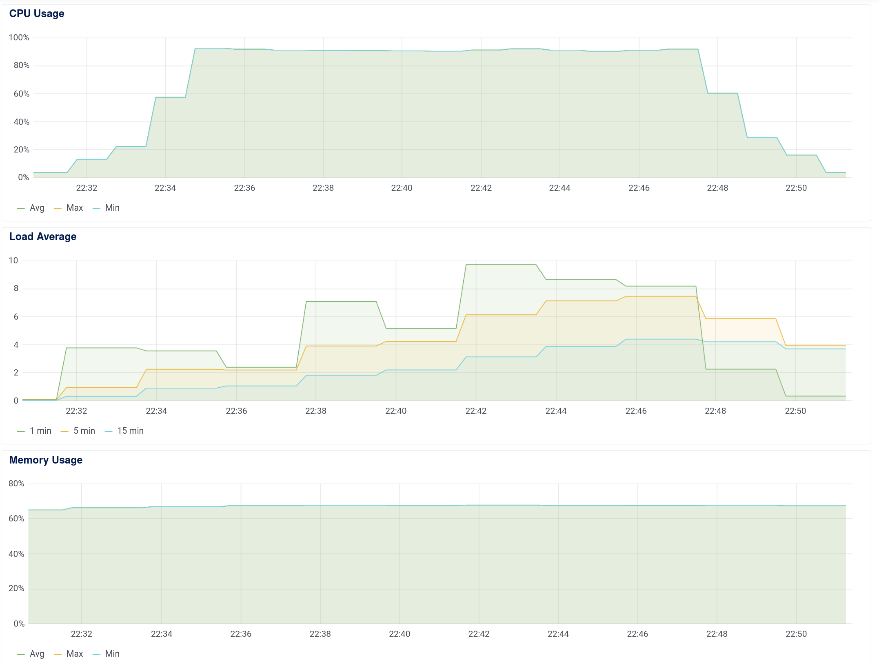

Running performance test

```bash
docker-compose -f docker-compose.yml build
docker-compose -f docker-compose.yml up -d
```

You can setup a fresh Fedora instance with the following command:

```bash
./setup.sh
```

The following image shows a 15 minute performance test with 72 TPS.



This was ran against the API server running on a Digital Ocean Kubernetes cluster with 1 node with 1 vCPU and 2GB of RAM.
We're running with 3 replicas for the API server and 2 replicas for the database.

The resource usage of the API server is shown below:



The CPU is close to 95% and the memory is around 1.5GB. Ideally we would use a more powerful node or multiple nodes with more API replicas.